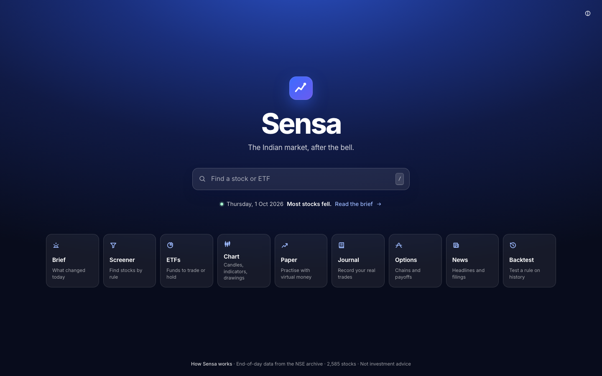

# Sensa

End-of-day analysis of the Indian market: a stock screener and research app for every company listed on the NSE.

**Live app:** https://nse-screener.pages.dev (private; sign-in required)



```bash
npm install
npm run sync   # download/refresh NSE data (first run fetches ~14 months, ~100 MB cached in data/raw)
npm run dev
```

The "Refresh data" button in the app re-runs the sync through the dev server. NSE publishes each day's file in the evening (IST).

## Brief, watchlist and forward log

The app opens on the **Brief** tab: what newly matched each followed screen, what dropped off, and anything notable on your watchlist (level crossed, 52-week high/low, big move, volume spike, upcoming ex-date).

```bash
npm run brief                  # refresh data, rebuild the brief, update the log
scripts/schedule.sh install    # do that automatically on weekdays at 19:30 (macOS launchd)
scripts/schedule.sh uninstall
```

- **Watchlist**: click the ☆ next to any stock; set a note and an alert level in its detail panel. Stored in `data/user/watchlist.json`.
- **Screens in the brief**: three by default; add the Screener's current criteria from the bottom of the Brief tab. Stored in `data/user/screens.json`.
- **Forward log** (`data/user/log.json`): every new match is recorded on the day it happens, then scored at 5, 10 and 20 sessions (bought at the next open, compared with the average liquid stock). It is never backfilled, so unlike a backtest it has no hindsight in it. Each day's brief is also archived in `data/user/briefs/`.

`data/user` is your own state; nothing regenerates it, so back it up if it matters.

## Running in the cloud

- **Nightly run**: `.github/workflows/brief.yml` builds the brief on GitHub Actions on weekdays at 19:30 and 22:00 IST, commits `data/user`, and publishes the app to Cloudflare Pages. Downloaded NSE files live in the Actions cache. The repo is the master copy of the forward log, so `git pull` before running the brief locally.
- **Hosted app**: Cloudflare Pages project `nse-screener`. Everything on it (pages, data, API) needs a signed-in account.
- **Accounts** (`server/auth.js`, `functions/`): people create their own account with a name, a password and the invite code, which is the `APP_PASSWORD` secret. Passwords are stored as PBKDF2 hashes in the `USER` KV namespace; a session is a signed cookie lasting 30 days. The first account created is the owner. Sign-in is limited to 10 tries per name per 15 minutes.
- **Per-user data**: each account has its own watchlist, paper account, trade journal and chart drawings (`u:<name>:…` in KV). Watchlist alerts and paper-trade fills are worked out in the browser from the published data files, so the nightly job handles no per-user data. The list of screens the brief follows is shared, and only the owner can change it.
- **Account panel** (click your name in the header): change password, sign out other devices, download your data, delete your account. A session cookie carries the account's version number; changing the password or signing out other devices bumps it, which invalidates older cookies. The owner's account can't be deleted from the app.
- **Removing someone / a forgotten password**: delete their account key and they can sign up again with the same name, keeping their data: `npx wrangler kv key delete "acct:<name>" --binding USER --remote`. Changing `APP_PASSWORD` changes the invite code for new sign-ups only.
- **Not available hosted**: Refresh data and Update brief; they need the local dev server.
- **When something goes wrong**: the app shows an amber banner once prices are five or more days old. The workflow fails if it finds no new session for more than five days, and any failed run opens a GitHub issue titled "Evening update failed" (one at a time).
- **Secrets**: `APP_PASSWORD` on the Pages project; `CLOUDFLARE_API_TOKEN` and `CLOUDFLARE_ACCOUNT_ID` in the GitHub repo. Until the GitHub secrets exist the workflow skips publishing.
- **Local test of the hosted build**: `npm run build && npx wrangler pages dev dist --kv USER` with `APP_PASSWORD` in `.dev.vars`. The local dev app (`npm run dev`) has no sign-in and a single user, stored in `data/user/`.

**Timing.** GitHub starts its own scheduled runs hours late, so the evening runs are started by a small Cloudflare Worker on a timer (`trigger/`, deployed as `sensa-evening-trigger`): 19:30 and 22:00 IST, Monday to Friday. It calls GitHub's API with a fine-grained token stored as the Worker secret `GITHUB_TOKEN` (this repository only; Actions: read and write). The workflow keeps one late scheduled run as a fallback.

## ETFs tab

349 exchange-traded funds listed on NSE, kept apart from the stocks (they are not in the Screener, the market statistics or the backtests) but usable everywhere else: search, the stock panel, the Chart tab, the watchlist and paper trading.

- **For trading**: the same price metrics as stocks, with relative strength ranked among ETFs only. Liquid funds are left out by default.
- **For long-term investing**: funds grouped by what they track, compared on yearly cost (total expense ratio), daily turnover, and price versus NAV today and on average over 60 sessions.
- Data (`scripts/etf.mjs`): NSE's `eq_etfseclist.csv` for the list and what each fund tracks; AMFI's `NAVAll.txt` and NAV history report for NAVs (matched by ISIN); AMFI's expense-ratio API (matched by scheme name, fetched for the current and previous month). Not available: fund size (AUM), tracking error and tax treatment.

## Chart tab

A full-screen chart (`src/ChartTab.tsx`) built on TradingView's open-source Lightweight Charts library (Apache 2.0; its logo on the chart is the attribution). Daily, weekly and monthly bars from three years of adjusted prices; candles, line or area; 20/50/200-day averages, a 20-day exponential average, Bollinger bands and volume on the price; RSI, MACD, delivery % and futures open interest in their own panels; comparison with an index or another stock as percentage change. The app's own information is drawn on top: pattern shapes and pivots, split/bonus/dividend markers, your alert level and paper-trade entry, stop and target.

Drawing tools are a horizontal level and a trendline, stored per stock in `data/user/drawings.json` (the `drawings` key in KV when hosted). A level can be turned into the stock's watchlist alert level. There are no intraday bars.

## Chart patterns

`scripts/patterns.mjs` detects five shapes with fixed rules: tight base near highs, base breakout, bull flag, cup with handle and double bottom breakout. The same code feeds the Screener (the "Chart patterns" list and filters), the overlay on the price chart (shaded shape and pivot line) and the backtest engine.

## Paper trading

A practice account with ₹10,00,000 of virtual money (`data/user/paper.json`; the `paper` key in KV when hosted). Orders are placed from a stock's panel, sized by the share of the account you are willing to lose at the stop. `advancePaper()` in `src/paperEngine.ts` runs in the browser whenever newer data is loaded: orders fill at the next session's open, stops and targets are checked against each day's range (stop first if both are touched; a gap fills at the open), 0.15% is charged per side, and positions are restated after a split or bonus.

## Trade journal

A hand-written record of real trades (`src/Journal.tsx`; `data/user/journal.json`, the `journal` key in KV when hosted). You enter your trading capital and the share of it you will risk per trade; the form then suggests the number of shares from the price and the stop. Open trades are valued at the latest close; closing a trade records the sale price, charges and what you learned. Results are shown in rupees and in R (profit divided by what the first stop put at risk), overall and by kind of trade. Long trades only. Nothing here places an order.

## Options tab

An end-of-day options workspace for every F&O underlying (indices and stocks): the option chain per expiry with open interest, its change, implied volatility and settlement prices; a strategy builder with common structures or legs picked from the chain; and call/put open interest by strike.

- Data: the latest session's full chain is kept in `data/raw/fo-chain/` and written to `public/data/options.json` and `public/data/o/<SYMBOL>.json` by `buildOptions()` in `scripts/derivatives.mjs`.
- Maths (`src/optionMath.ts`): Black-Scholes on the forward the chain implies through put-call parity, 6.5% rate. Payoff at expiry and on any earlier day, max profit and loss, breakevens, net delta/theta/vega, and a model "chance of profit" from the at-the-money IV.
- Not modelled: margin, brokerage and taxes, liquidity, early exercise, mixed expiries. Prices are settlement prices, not tradable quotes.

## Ownership, flows, valuation and results tracker

Added 2026-10-08, all from official feeds on `www.nseindia.com/api` (the listings host, not the rate-limited archive):

- **Ownership** (`scripts/holders.mjs`, kept in `data/raw/holders/state.json`): a year of bulk and block deals, a year of share purchases and sales disclosed by promoters and large holders (SAST regulation 29), promoter holding at each shareholding filing (up to eight per company) and the pledged share of it. Shown on the stock panel, as Screener filters (promoter holding, its change, pledged %) and, for the latest session, as "Large trades" in the brief. These filters cannot be backtested. NSE's insider-trading (PIT) listing returned nothing after about April 2026, so it is not used.
- **Peers**: on the stock panel, the six companies of the same sector closest in market cap, with the sector median. Built in the browser from the screener rows.
- **Institutional flows**: the day's net FII and DII buying in the cash market. NSE publishes only the latest day, so Sensa keeps its own record in `data/user/flows.json` (committed by the evening job); the trend fills in from the day this was added.
- **Index valuation**: P/E, P/B and dividend yield of five Nifty indices from the daily index file, with where today's P/E sits within the days Sensa has (about three years).
- **Results tracker** (News tab): companies whose latest results were filed in the last 21 days, with year-on-year growth and the stock's move on the first session that could react. The results downloader now reads the two newest quarters first, then the same quarters a year earlier.

The brief panels and tracker read `public/data/pulse.json`, written by `sync()`.

## Macro backdrop (prediction markets)

A small table in the brief: what prediction markets expect on the outside events that matter most to Indian stocks. `scripts/odds.mjs` (run by the evening update) takes one snapshot from Polymarket's public Gamma API (`gamma-api.polymarket.com`, no key) and writes `public/data/odds.json` with at most six lines: the likeliest outcome of the next two US Fed decisions, US recession odds, the oil price level traders are least sure about, and the two most traded conflict questions. Questions with under $5,000 traded in a day are left out.

It is background, not a signal: one snapshot an evening of a market that trades all day. A fuller version (a tab of 42 questions with paper bets) was built and cut back on 2026-10-08 because most of it was noise. Polymarket's own site and terms of service could not be opened from this connection, so its terms on showing its data have not been read. If Polymarket can't be reached, the previous snapshot stays.

## Backtest

```bash
npm run backtest   # first run downloads ~3 years of history (~235 MB in data/raw)
```

Replays the preset screens (`src/presets.json`, shared with the app) over history and writes `public/data/backtest.json`, shown in the Backtest tab. A signal is the first day a stock matches; entry is the next open, exit the close 5/10/20 sessions after the signal; results are compared with the average of all stocks with ₹1 Cr+ turnover over the same dates. No costs or slippage, and only currently listed companies are tested (survivorship bias).

**Custom screens.** In the app, set criteria in the Screener, click "Backtest this screen", and choose a holding period, optional stop-loss and profit target, and round-trip costs. Runs are kept in the browser for side-by-side comparison. The trade model lives in `scripts/engine-core.mjs`, which has no Node dependencies and so runs in two places with identical results:

- **Local app**: through the dev server (`/api/backtest`), which keeps the history in memory after the first run.
- **Hosted site**: in the browser (`src/backtestClient.ts`). `npm run pack` (run nightly by the workflow) writes three years of prices and indicators to `public/data/bt` as flat 32-bit float columns, about 180 MB in all; a backtest downloads only the columns it needs (roughly 25–50 MB the first time each day). Add `?clientbt` to the local app's address to exercise this path.

**Rule search.** `npm run search` tests 1,260 combinations (entry rule × trend filter × liquidity floor × holding period × exit) after 0.3% costs, picks the ones that look good before 1 Oct 2025, and re-checks only those on the year after. Output goes to the console and `public/data/search.json`.

## Data

All from the NSE archive, one set of files per trading session, cached in `data/raw`:

- **Prices, volume, delivery %**: the full bhavcopy (`sec_bhavdata_full_DDMMYYYY.csv`), series EQ/BE/BZ, limited to symbols in NSE's company master so ETFs and bonds are excluded.
- **Corporate actions**: `bc*.csv` inside `PRddmmyy.zip`. Splits, bonuses, rights issues, demergers and dividends with ex-dates, including ones announced up to about six sessions ahead.
- **Market cap and issued shares**: `mcap*.csv` inside the same zip (kept for the first session of each month and the latest three).
- **P/E**: `PE_ddmmyy.csv` (available from 2024).
- **Quarterly results**: the structured (XBRL) results filings in the NSE archive, for quarters from March 2024. Which filings exist comes from two listings on `www.nseindia.com/api` (`integrated-filing-results` for quarters from March 2025, `corporates-financial-results` before that). `scripts/results.mjs` reads each filing once and keeps the figures it uses in `data/raw/results/parsed.json`; a run reads at most 300 new filings, two at a time with a pause (the archive blocks an address that asks for more; a block lasts roughly half an hour and also stops the price files) (`RESULTS_MAX`), newest quarters first, so a first run fills in over several nights. If the listing can't be reached the run carries on with what it has.
- **Index membership and sector**: NSE index constituent lists. Only the ~750 Nifty Total Market stocks carry a sector.

- **Derivatives**: the F&O bhavcopy (both the pre- and post-July 2024 formats), `fao_participant_oi_*.csv`, `ind_close_all_*.csv` and `fo_secban.csv`. Each session's 6 MB bhavcopy is reduced to a small summary in `data/raw/fo/` by `scripts/derivatives.mjs`.
- **Filings**: `an*.txt` (announcements) and `bm*.txt` (board meetings) inside the PR zip, kept for the last 12 sessions.
- **Headlines**: public RSS feeds from Economic Times, Mint, Business Standard, BusinessLine and CNBC-TV18. Only headline, blurb, source and link are stored (`scripts/news.mjs`).

`scripts/sync.mjs` writes `public/data/screener.json` (one row per stock) and `public/data/h/<SYMBOL>.json` (price history and corporate actions for the detail panel). Both are generated and git-ignored. `scripts/fundamentals.mjs` holds the corporate-action, market-cap and P/E loaders.

## How the numbers are built

- **Price adjustment**: earlier prices are scaled at each official split, bonus, rights issue and demerger. Splits and bonuses use the announced ratio and are only applied where the opening gap confirms them, on the stated ex-date or within five sessions (ex-dates get revised). Demergers carry no ratio, so the opening gap is used. A stock that opens more than 23% down with no official action on record is still adjusted and marked "inferred". Dividends are not adjusted.
- **Relative strength (RS)** = each stock's weighted return (40% last 3 months, 20% each for 6, 9 and 12 months) ranked 1–99 across all stocks; needs six months of history.
- **Market section of the brief**: breadth and leadership across stocks with ₹1 Cr+ daily turnover, using the median stock in each size group and sector (not index levels).
- **Futures position** on F&O stocks: open interest is summed across expiries; a day counts as long build-up (price up, OI up 3%+), short build-up (price down, OI up), short covering (price up, OI down 3%+) or long unwinding (price down, OI down). Not flagged in a stock's first 20 sessions in F&O.
- **IV** = at-the-money implied volatility (Black-Scholes, 6.5% rate) from the nearest expiry with 3+ days left; **IV rank** = share of the past year's sessions with a lower IV.
- **Index positioning** in the Brief: put/call ratio, max pain, and the strikes with the most put OI below and call OI above the price for the nearest expiry; net index-futures positions by participant type.
- **Sales and profit growth** compare the latest quarter with the same quarter a year earlier. **Operating margin** = (profit before tax + finance costs + depreciation − other income) / sales for the latest quarter. **Return on equity** = the last four quarters' profit attributable to shareholders / shareholders' equity on the latest balance sheet. **Debt to equity** = current plus non-current borrowings (lease liabilities excluded) / that equity. Consolidated figures are used where the company files them. Each session uses only filings public by then (one filed after 3:30 pm counts from the next session), so backtests on these fields don't look ahead. Banks and other lenders get growth and return on equity only.
- **EPS** = price / P/E. **Earnings growth** = trailing earnings (market cap / P/E) versus 252 sessions earlier. **Dividend yield** = dividends with an ex-date in the last 12 months / price.
- **Large / mid / small cap** = market-cap rank 1–100 / 101–250 / the rest.

## Limits

- End-of-day only; no intraday or live quotes.
- Results-based figures start with the March 2024 quarter, so growth and return on equity exist only from about mid-2025 and backtests on them cover about 18 months. The balance sheet is filed twice a year, so debt and equity can be up to six months old. Insurers and a few companies with unusual filings have no results figures. Loss-making companies have no P/E.
- Earnings growth is derived from two P/E readings a year apart, so it is approximate and swings wildly when the earlier earnings were near zero.
- P/E history starts in 2024 and market-cap snapshots in Feb 2024, so backtests on fundamentals cover a shorter period than price-only ones.
